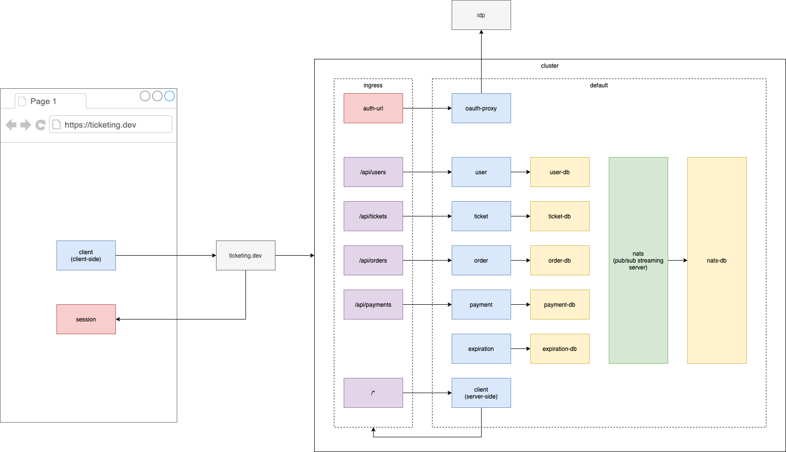
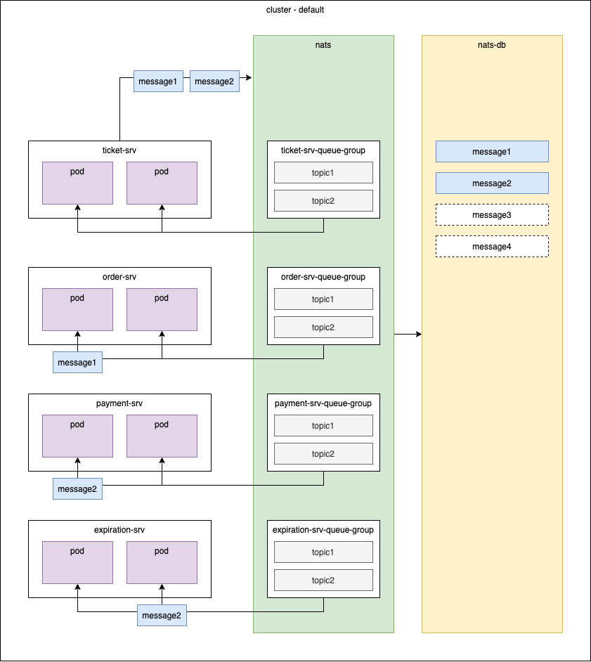

# Ticketing Microservice Demo

## Setup

Creates some demo secrets:

```sh
make setup
```

Add the following to your hosts file:

```sh
0.0.0.0 ticketing.dev
```

## Usage

Launches all micro services on your local cluster and watches for changes:

```sh
make dev
```

## Architecture




